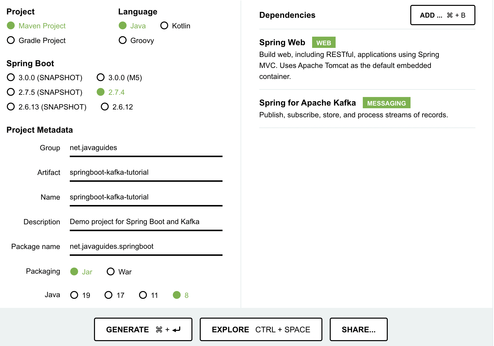

# Spring Boot Kafka Project

## Spring initializr


Open the extracted file in intellij

## Kafka topic
- set up kafka topic configuration in ```application.properties```

```
spring.kafka.consumer.bootstrap-servers= localhost:9092
spring.kafka.consumer.group-id=myGroup
spring.kafka.consumer.auto-offset-reset=earliest
spring.kafka.consumer.key-deserializer=org.apache.kafka.common.serialization.StringDeserializer
spring.kafka.consumer.value-deserializer=org.apache.kafka.common.serialization.StringDeserializer

spring.kafka.producer.bootstrap-servers=localhost:9092
spring.kafka.producer.key-serializer=org.apache.kafka.common.serialization.StringSerializer
spring.kafka.producer.value-serializer=org.apache.kafka.common.serialization.StringSerializer
```

- **create topic of kafka** in springboot application.
    - Create ```KafkaTopicConfic``` class under config package. This class created kafka topic in a kafka cluster using spring boot application

## Create kafka producer
- create ```KafkaProducer``` class under kafka package.
    - use spring provided kafka template
    - use constructor dependency to inject the kafkak template
    - create a method that use kafka template to send th message. and log to print message.

## Create REST API to Send Message

**REST API send message to Producer**

- create ```MessageController``` class
- inject kafka producer, then create a rest endpoint. 
- copy this link to webpage
```http:localhost:8080/api/v1/kafka/publish?message=hello world```
- Wegpage shows ***Message sent to the topic***
- verify if the message is written to the kafka topic. STEP 5 in [here](https://kafka.apache.org/quickstart). open a new terminal, change the topic name from:

    ```
    bin/kafka-console-consumer.sh --topic quickstart-events --from-beginning --bootstrap-server localhost:9092
    ```

    to 

    ```
    bin/kafka-console-consumer.sh --topic javaguides --from-beginning --bootstrap-server localhost:9092
    ```

- the message you wrote (hello world in this case, will shows in terminal)

## Create kafka consumer
- create ```KafkaConsumer```class under kafka package.
- use ```@KafkaListener(topics = "javaguides", groupId = "myGroup")``` for consumer method
- after this step, the message sent by producer can be recived by consumer.

## Configure Kafka Producer and Consumer for JSON Message

logmon.rawlog

bin/kafka-console-consumer.sh --topic logmon.rawlog --from-beginning --bootstrap-server localhost:9092

@casprConfiguration.CASPR_TOPIC
